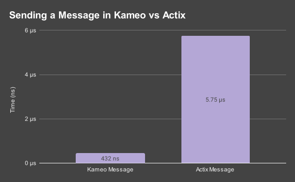

# Kameo 🧚🏻


#### Fault-tolerant Async Actors Built on Tokio


- **Async**: Built on tokio, actors run asyncronously in their own isolated spawned tasks.
- **Supervision**: Link actors, creating dependencies through child/parent/sibbling relationships.
- **MPSC Unbounded Channels**: Uses mpsc channels for messaging between actors.
- **Concurrent Queries**: Support concurrent processing of queries when mutable state isn't necessary.
- **Panic Safe**: Catches panics internally, allowing actors to be restarted.

---

### Installing

**Stable**

```toml
[dependencies]
kameo = "*"
```

**Nightly**

Nightly allows for some cleaner apis thanks to specialization.

Notably,

- `Message::Reply` and `Query::Reply` can be any type, not just `Result` types.
- `spawn_unsync` and other `_unsync` methods are not required - `!Sync` actors are inferred automatically.


```toml
[dependencies]
kameo = { version = "*", features = ["nightly"] }
```

### Defining an Actor without Macros

```rust
// Define the actor state
struct Counter {
    count: i64,
}

impl Actor for Counter {}

// Define messages
struct Inc { amount: u32 }

impl Message<Inc> for Counter {
    type Reply = Result<i64, Infallible>;

    async fn handle(&mut self, msg: Counter) -> Self::Reply {
        self.count += msg.0 as i64;
        Ok(self.count)
    }
}
```

### Defining an Actor with Macros

```rust
// Define the actor state
#[derive(Actor)]
struct Counter {
    count: i64,
}

// Define messages
#[actor]
impl Counter {
    #[message]
    fn inc(&mut self, amount: u32) -> Result<i64, Infallible> {
        self.count += amount as i64;
        Ok(self.count)
    }
}
```

<details>
  <summary>See generated macro code</summary>

```rust
// Derive Actor
impl kameo::Actor for Counter {
    fn name(&self) -> Cow<'_, str> {
        Cow::Borrowed("Counter")
    }
}

// Messages
struct Inc { amount: u32 }

impl kameo::Message<Inc> for Counter {
    type Reply = Result<i64, Infallible>;

    async fn handle(&mut self, msg: &mut Inc) -> Self::Reply {
        self.inc(msg.amount)
    }
}
```
</details>

<sup>
<a href="https://docs.rs/kameo/latest/kameo/derive.Actor.html" target="_blank">Actor</a>
 • 
<a href="https://docs.rs/kameo/latest/kameo/attr.actor.html" target="_blank">#[actor]</a>
</sup>

### Spawning an Actor & Messaging

```rust
use kameo::{Spawn, ActorRef};

let counter_ref: ActorRef<Counter> = Counter { count: 0 }.spawn();

let count = counter_ref.send(Inc(42)).await?;
println!("Count is {count}");
```

<sup>
<a href="https://docs.rs/kameo/latest/kameo/trait.Spawn.html#method.spawn" target="_blank">Spawn::spawn</a>
 • 
<a href="https://docs.rs/kameo/latest/kameo/trait.ActorRef.html#method.send" target="_blank">ActorRef::send</a>
</sup>

## Benchmarks

**13x higher throughput when compared with Actix**



Above shows a basic benchmark for sending a message to an actor in Kameo and Actix.
Always benchmark for yourself.

<details>
<summary>Benchmark results</summary>

Sending a message to an actor

| Benchmark            | Time      |
|----------------------|-----------|
| Kameo Unsync Message | 432.26 ns |
| Kameo Sync Message   | 503.89 ns |
| Kameo Query          | 1.3000 µs |
| Actix Message        | 5.7545 µs |


Processing fibonachi sequence in an actor up to 20

| Benchmark            | Time      |
|----------------------|-----------|
| Kameo Unsync Message | 18.229 µs |
| Kameo Sync Message   | 18.501 µs |
| Kameo Query          | 19.257 µs |
| Actix Message        | 27.442 µs |
</details>

## Contributing

Contributions are welcome! Feel free to submit pull requests, create issues, or suggest improvements.

## License

`kameo` is dual-licensed under either:

- MIT License ([LICENSE-MIT](LICENSE-MIT) or http://opensource.org/licenses/MIT)
- Apache License, Version 2.0 ([LICENSE-APACHE](LICENSE-APACHE) or http://www.apache.org/licenses/LICENSE-2.0)

at your option.
